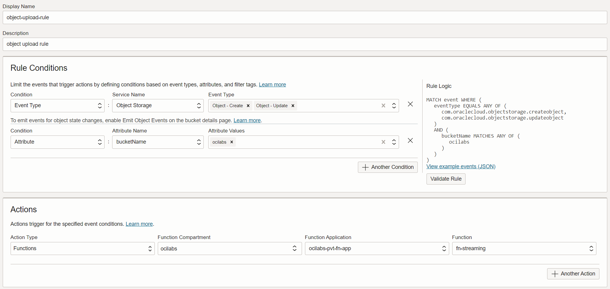
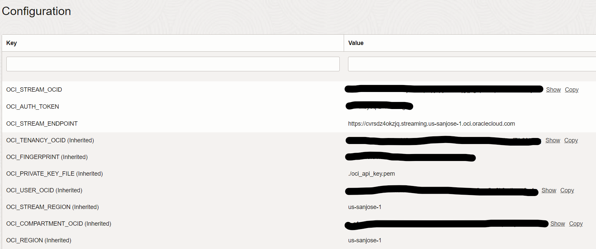

# OCI Function for Pushing Messages to a Private Streaming Endpoint upon Object Upload

This function leverages Resource Principals for secure authorization, allowing the function to utilize the [OCI Python SDK](https://oracle-cloud-infrastructure-python-sdk.readthedocs.io/en/latest/index.html) for making API calls to OCI services. It retrieves the content of an uploaded object from an Object Storage bucket and proceeds to send the event and file data to a private stream endpoint.

The function calls the following OCI Python SDK classes:
* [Resource Principals Signer](https://oracle-cloud-infrastructure-python-sdk.readthedocs.io/en/latest/api/signing.html#resource-principals-signer) to authenticate
* [Object Storage Client](https://oracle-cloud-infrastructure-python-sdk.readthedocs.io/en/latest/api/object_storage/client/oci.object_storage.ObjectStorageClient.html) to interact with Object Storage
* [OCI Stream Client](https://oracle-cloud-infrastructure-python-sdk.readthedocs.io/en/latest/api/streaming/client/oci.streaming.StreamClient.html) to publish message to stream endpoint


## Pre-requisites

1.  Setup your Functions application and Streaming service (Stream pool and Stream). Please make sure the function and OSS stream are in the same VCN.

2. Please gather the following information. These values are required to configure the environment variables for function application
    * User ID  – The OCID of the user to authenticate with.
    * Tenancy ID  – Tenancy OCID. Can be found in user profile.
    * Fingerprint  – Will be used to authenticate to the OCI API.
    * Region – Identifier of the region to create the requests in.    
    * API private key  - API private key file location
    * Stream OCID - OSS Stream OCID
    * Auth Token  - Auth Token from User settings
    * Stream endpoint - OSS Stream endpoint (Obtained from "Messages Endpoint" from Stream information screen)

## Configuration

1.  Event Rule configuration
    
    

1.  Function configuration
    
    


## List Applications 

Assuming you have successfully completed the prerequisites, you should see your 
application in the list of applications.

```
fn ls apps
```


## Create or Update Dynamic Group for OCI function

In order to use other OCI Services, your function must be part of a dynamic 
group. For information on how to create a dynamic group, refer to the 
[documentation](https://docs.cloud.oracle.com/iaas/Content/Identity/Tasks/managingdynamicgroups.htm#To).

When specifying the *Matching Rules*, we suggest matching all functions in a compartment with:

```
ALL {resource.type = 'fnfunc', resource.compartment.id = 'ocid1.compartment.oc1..aaaaaxxxxx'}
```


## Required IAM Policies

Create a new policy that allows the dynamic group to `read objects` in
the functions related compartment.


Your policy should look something like this:
```
Allow dynamic-group <dynamic-group name> to read objects in compartment <compartment-name>
```
e.g.
```
Allow dynamic-group oci-streaming-fn-dyn-group to read objects in compartment ocilabs-fn-compartment
```

For more information on how to create policies, go [here](https://docs.cloud.oracle.com/iaas/Content/Identity/Concepts/policysyntax.htm).


## Required files to build and deploy OCI function

Review the following files in the current folder:

- [requirements.txt](./requirements.txt) specifies all the dependencies for your function
- [func.yaml](./func.yaml) that contains metadata about your function and declares properties
- [func.py](./func.py) which is your actual Python function

The name of your function *fn-streaming* is specified in [func.yaml](./func.yaml).


## Deploy the function

In Cloud Shell, run the *fn deploy* command to build the function and its dependencies as a Docker image, 
push the image to the specified Docker registry, and deploy the function to Oracle Functions 
in the application created earlier:

```
fn -v deploy --app <app-name>
```
e.g.
```
fn -v deploy --app myapp
```
## Test
To test this function, please follow the provided steps below.
  - Please make sure to enable the Function Invocation and event Rule execution logs.

  - Upload a file in the object storage bucket configured in the event rule configuration created before. 
    This will trigger the event rule and execute the function.Please note that it will take some time before we can see the function execution logs.
  
  - To check if the private streaming received the messages, we can use the OCI cli commands from the same VCN:
    
        oci streaming stream cursor create-cursor --stream-id <STREAM_ID> --partition 0 --type TRIM_HORIZON  --endpoint  <STREAM_ENDPOINT_URL>
        oci streaming stream message get --stream-id <STREAM_ID> --endpoint  <STREAM_ENDPOINT_URL> --cursor <CURSOR_OBTAINED_FROM_PREV_COMMAND>